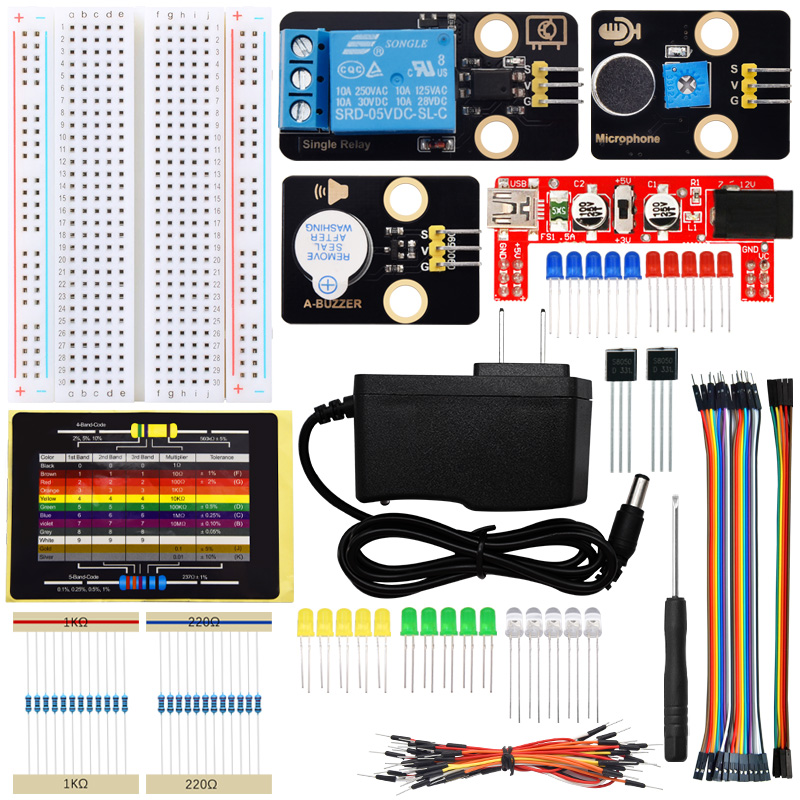

**特别注意：本套件(产品)不包含课程中使用到的开发板，扩展板和USB线，需要另外购买。**

 
 

首先感谢选择keyes产品，我们将继续为你提供好的产品和服务!

---

**关于keyes**   

Keyes是KEYES Corporation旗下最畅销的品牌，我们的产品包括Arduino开发板、扩展板、传感器模块；树莓派、micro：bit扩展板和智能小车；以及为各阶段客户设计的完整入门套件。这些入门套件旨在为任何水平的客户学习Arduino、树莓派、micro：bit相关知识。

我们所有产品，均符合国际质量标准，在世界各地不同市场中，得到了极大的赞赏。

欢迎从我们的官方网站查看更多内容：[http://www.keyes-robot.com](http://www.keyes-robot.com)

---

**售后服务**  

1\. 如果发现某些东西丢失或损坏，或者学习套件时遇到一些困难，keyes会提供免费和快速的支持。如果您有任何疑问，请联系我们我们客服或工作人员。

2\. 欢迎提出建议和反馈，我们会根据您的反馈不断更新套件和教程，以使其更好。谢谢！

---

**产品安全**   

1\. 本产品内含细小的元器件（电阻，LED等），请放在儿童接触不到的地方，防止划伤或误食。8岁及以下儿童使用，请在大人监督下使用。

2\. 本产品包含导电部件(控制板和电子模块），请按照本教程的要求进行操作，不当的操作可能导致过热并且损害零件，请勿触摸并立即断开电路电源（请按照正确的方式安装电池）。

---

**版权**
                                   
keyes商标和徽标是KEYES DIY ROBOT co.,LTD的版权,任何人和公司在没有授权的情况下，不得复制，售卖，转卖，keyes品牌的产品。如果您有兴趣在当地售卖我们的产品，请联系我们专业的批发销售人员。

---

**Keyes 声音检测套件**

---

# 产品介绍

声音检测套件集于声音传感器、继电器模块、有源蜂鸣器模块、电阻和各种LED等模块与元件，通过Plus主板或Micro:Bit主板或树莓派Pico主板或ESP32主板或不配主板不编程进行控制。使用Arduino C 软件或MakeCode软件或Mixly软件或KidsBlock软件或Thonny软件进行编程，可以控制LED、蜂鸣器和其他模块工作，并且还可以通过声音传感器将外界声音的大小，转换成对应的模拟数值。如果检测到的声音超过一定值时，则蜂鸣器发出警报声，LED会闪烁。通过这种方式，可以提醒人们应该减少噪音，声音检测报警系统适用于城市交通或一些室内等场所。

---

